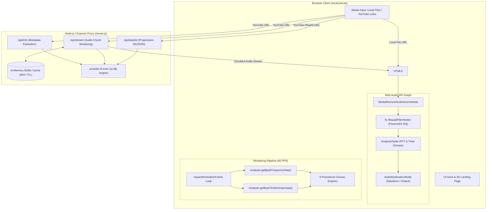

# AuraCanvas — Immersive 3D Audio Visualizer & Music Player

<div align="center">


**A high-performance, browser-native 3D audio visualizer and studio music player.**  
Harnessing native Web Audio API nodes and procedural HTML5 Canvas rendering to transform any sound into captivating, real-time 60 FPS reactive visual spectacles.

[🚀 Live Demo](https://musicappspeed1.netlify.app/) • [✨ Features](#-comprehensive-features) • [🎨 Visual Engines](#-9-procedural-visual-engines) • [🏗️ Architecture](#️-media--streaming-pipeline) • [⚡ Quick Start](#-quick-start--local-setup) • [🚀 Deployment](#-deployment)

</div>

---

## 🌟 Overview

**AuraCanvas** blends studio-grade audio processing with real-time procedural canvas visuals. Built entirely with zero heavy frontend frameworks (Vanilla HTML5, CSS3, and ES6+ JavaScript), it delivers butter-smooth 60 FPS animations, deep acoustic controls, and flexible media ingestion from local files to progressive YouTube streaming.

Whether you're listening to local tracks or streaming YouTube albums, AuraCanvas analyzes time-domain and frequency data in real time, routing the audio through customizable 5-band biquad filters and projecting the energy across 9 handcrafted mathematical visualizer modes.

---

## ✨ Comprehensive Features

### 1. 🎛️ Studio-Grade Audio Deck
- **5-Band Parametric Equalizer**: Real-time frequency sculpting powered by native `BiquadFilterNode`s (60Hz, 230Hz, 910Hz, 3.6kHz, 14kHz) with a ±12dB dynamic gain range.
- **10 Curated EQ Presets**: Instant acoustic calibration:
  - *Flat*, *Bass Boost*, *Treble Boost*, *Electronic/Dance*, *Hip-Hop*, *Rock*, *Pop*, *Classical*, *Acoustic*, and *Spoken Word/Podcast*.
- **Variable Playback Speeds**: Fine-grained speed control from ultra-slow **0.1x** up to hyper-speed **8.0x**.
- **Interactive Seekbar & Hover Waveform**: Scrub tracks with precision. Local audio files decode PCM channel buffers to render mirrored amplitude waveforms on hover.
- **Queue & Playlist Controls**: True mathematical Fisher-Yates shuffle, loop single track, repeat playlist, and previous/next navigation.

### 2. 🎨 9 Procedural Visual Engines
Switch dynamically between 9 physics-driven and mathematical visual modes rendered at 60 FPS:

| Mode | Visual Paradigm | Audio Reactivity |
| :--- | :--- | :--- |
| **Mandala** | Concentric geometric rings | Bass pulses scale radius; high frequencies extrude outer geometry. |
| **Particle Swarm** | Chaotic physics particle field | Sub-bass accelerates particle velocity; transients trigger radiant color shifts. |
| **Oscilloscope Wave** | Real-time time-domain waveform | Directly plots raw audio amplitude waves with high-resolution glowing lines. |
| **Neon Spectrum Bars**| Symmetrical frequency spectrum | Frequency bin heights bounce dynamically with peak drop meters and neon glow. |
| **Warp Drive** | 3D hyperspace starfield tunnel | Kick beats trigger warp acceleration, stretching stars into relativistic streaks. |
| **Synthwave Grid** | Retro 80s 3D perspective wireframe | Audio energy distorts the rolling mountain horizon and pulsing neon retro sun. |
| **Audio Plexus** | Interconnected celestial node network| Mid/high energy establishes distance-based links and particle node expansion. |
| **Fractal Echo** | Recursive rotating hexagon tunnel | Rotational velocities invert per ring; line thickness and ring gaps modulate with audio. |
| **Liquid Nebula** | Organic fluid metaball clouds | Multi-layered radial gradients composite smoothly using `screen` blend mode. |

### 3. 🌓 Dynamic Adaptive UI & Glassmorphism
- **Chrono-Reactive Theming**: Color palettes automatically shift according to the user's local hour:
  - 🌅 **Morning (06:00 - 12:00)**: Warm Sunrise Peach & Coral (`#FF9A9E` / `#FFB796`)
  - ☀️ **Daylight (12:00 - 18:00)**: Vivid Electric Cyan & Sky Blue (`#00F2FE` / `#4FACFE`)
  - 🌆 **Sunset (18:00 - 22:00)**: Hot Crimson & Bright Coral (`#FF0844` / `#FF7864`)
  - 🌌 **Night (22:00 - 06:00)**: Deep Neon Cyan & Royal Blue (`#00C6FF` / `#0072FF`)
- **Custom Color Override**: Interactive color picker allowing users to override the dynamic theme with any personal hex/RGB accent.
- **Custom Photo & Video Backgrounds**: Upload local images or `.mp4` video backgrounds. Video backgrounds run muted, hardware-accelerated, and natively looped behind the transparent canvas visualizer.
- **3D Hero Entrance**: Landing view featuring split-letter kinetic velocity typography, floating 3D polyhedral hyper-diamonds, interactive mouse parallax, and orbiting planetary asteroid belts.

### 4. 📂 Flexible Media Ingestion
- **Local Files & Folders**: Native drag-and-drop or file upload for `.mp3`, `.wav`, and `.ogg` audio files, with folder recursion support.
- **YouTube Single Tracks**: Paste any YouTube link. AuraCanvas extracts video metadata via `/api/info` and streams live audio through `/api/stream`.
- **Progressive YouTube Playlists**: Paste a YouTube playlist URL. The proxy backend streams discovered tracks line-by-line via NDJSON (`/api/playlist`), progressively appending items to the queue and instantly starting track #1 without waiting for entire playlists to resolve.
- **Robust Request Cancellation**: Uses `AbortController` and generation tokens to cancel outdated or superseded playlist/stream requests when users switch inputs rapidly.

---

## 🏗️ Media & Streaming Pipeline



> **Note on YouTube Streaming:**  
> AuraCanvas avoids expensive, CPU-intensive server-side transcoding. The backend proxy invokes `yt-dlp` with `-f bestaudio` and pipes standard web-compatible audio streams (`audio/webm` Opus/AAC) straight to the HTTP response, allowing the browser's native decoder to stream directly into the Web Audio API.

---

## 🛠️ Tech Stack

- **Frontend**:
  - Semantic HTML5, Vanilla CSS3 (Custom properties, 3D transforms, Glassmorphic backdrop filters)
  - Vanilla JavaScript (ES6+, Modules, Web Audio API, Canvas 2D API)
  - Google Fonts: *Syncopate*, *Inter*, *Montserrat*
- **Backend Stream Proxy**:
  - Node.js (v18+ recommended)
  - Express.js (REST routes, CORS, Static file serving)
  - `youtube-dl-exec` / `yt-dlp` (High-efficiency stream & metadata extraction)
- **Deployment & Infra**:
  - Vercel (Static frontend hosting with preconfigured security headers & caching in `vercel.json`)
  - Node.js / Docker / VPS (For proxy server execution)

---

## 📁 Project Structure

```text
Music_web/
├── index.html            # Main SPA HTML structure (Hero + Visualizer + Studio Deck)
├── styles.css            # Complete styling (Glassmorphism, 3D transforms, Animations)
├── app.js                # Core frontend audio graph, visualizer engines & event handling
├── asteroid.png          # Asset: 3D orbiting asteroid graphic
├── vercel.json           # Vercel deployment configuration (caching, security headers)
├── .vercelignore         # Exclusion rules for production builds
├── AUDIT.md              # Detailed architecture & engineering audit report
├── LICENSE.md            # MIT License documentation
├── README.md             # Project documentation
│
└── server/
    ├── server.js         # Express stream proxy (yt-dlp extraction, in-memory cache, NDJSON)
    ├── package.json      # Backend dependencies (express, cors, youtube-dl-exec)
    └── cookies.txt       # (Optional) Exported YouTube cookies to prevent 403 blocks
```

---

## ⚡ Quick Start & Local Setup

### Prerequisites
- [Node.js](https://nodejs.org/) (version 18.0.0 or higher recommended)
- A modern web browser supporting the Web Audio API and Canvas (Chrome, Edge, Firefox, Brave, Safari)

### 1. Clone the Repository
```bash
git clone https://github.com/NotShinobu34/Aura-Visualizer.git
cd Aura-Visualizer
```

### 2. Configure & Start the Backend Proxy
The backend server handles YouTube metadata extraction and audio streaming.

```bash
cd server
npm install
node server.js
```
The server will boot on `http://localhost:3001`.

> [!TIP]
> **Avoid YouTube 403 Rate Limits**: YouTube occasionally challenges proxy servers with bot verifications. To ensure seamless streaming, export your YouTube cookies from your browser using an extension (such as *Get cookies.txt LOCALLY*) and save the resulting file as `server/cookies.txt`. The server will automatically detect and authenticate with it.

### 3. Launch the Frontend
You have two options to run the frontend:

#### Option A: Served via Node.js Server (Easiest)
Because `server/server.js` serves static frontend files by default, you can simply visit:
```text
http://localhost:3001
```

#### Option B: Dedicated Local Web Server
If you are developing frontend styles or logic, you can run a local development server from the repository root:
- **VS Code Live Server**: Right-click `index.html` → **Open with Live Server**.
- **Python HTTP Server**:
  ```bash
  python -m http.server 5500
  ```
- **Vite / npx serve**:
  ```bash
  npx serve .
  ```

Once loaded, click **"LAUNCH VISUALIZER"** to initialize the Web Audio context!

---

## 🚀 Deployment

### Frontend (Vercel)
The repository includes a battle-tested [`vercel.json`](file:///c:/Projects/Music_web/vercel.json) configured with:
- Strict security headers (`nosniff`, `SAMEORIGIN`, permissive CORS).
- Optimal browser caching for assets (`asteroid.png`, `styles.css`, `app.js`).
- Clean URL routing.

To deploy the frontend to Vercel:
```bash
npx vercel
```

### Backend Proxy (Render / Railway / VPS / Docker)
Because `yt-dlp` requires Python and system process execution permissions, host the `server/` directory on a platform supporting Node.js with container/process execution:
- **Render / Railway / Fly.io**: Deploy as a Web Service pointing to `server/server.js`.
- **Environment Variables**:
  - `PORT`: Server listening port (defaults to `3001`).

---

## ⌨️ Controls & Interactions

| Action | Control / Interaction |
| :--- | :--- |
| **Play / Pause** | `Spacebar` or Play/Pause deck button |
| **Volume Adjustment**| Volume slider or `Mute` toggle icon |
| **Audio Sensitivity**| Sensitivity slider (amplifies frequency response across all modes) |
| **Visualizer Switch**| Radio selectors on the bottom visualizer bar |
| **Equalizer Deck** | Click `EQ` toggle button in top navigation |
| **Playlist View** | Click `Playlist` icon in top navigation |
| **Upload Files** | Click `Upload Local Music` or drag & drop audio files anywhere |
| **YouTube Input** | Click `Upload Link`, choose **Single Song** or **Playlist**, paste link & load |
| **Dynamic Color** | Open `Personalize` deck → toggle `Custom Color Override` |
| **Custom Background**| Open `Personalize` deck → upload any photo or `.mp4` video |

---

## ❓ Frequently Asked Questions & Troubleshooting

### Why is there no sound when the page first loads?
Modern web browsers enforce an **Autoplay Policy** requiring explicit user gestures before activating an `AudioContext`. Simply click **"LAUNCH VISUALIZER"** or press the **Play** button to enable sound.

### Why do some YouTube songs return `403 Forbidden` or `Extraction Failed`?
YouTube regularly updates rate limits and bot-detection heuristics. If a link fails to load:
1. Export a fresh `cookies.txt` file from your logged-in YouTube account.
2. Place `cookies.txt` inside the `server/` directory.
3. Restart `node server.js`.

### Can I stream audio without the backend server running?
Local audio files (`.mp3`, `.wav`, `.ogg`) and custom background videos run 100% locally in your browser without requiring the backend proxy. The Node.js server is only needed when fetching and streaming media from YouTube.

---

## 📄 License

This project is open-source software licensed under the [MIT License](file:///c:/Projects/Music_web/LICENSE.md).

```text
Copyright (c) 2026 Shinobu-34
```
